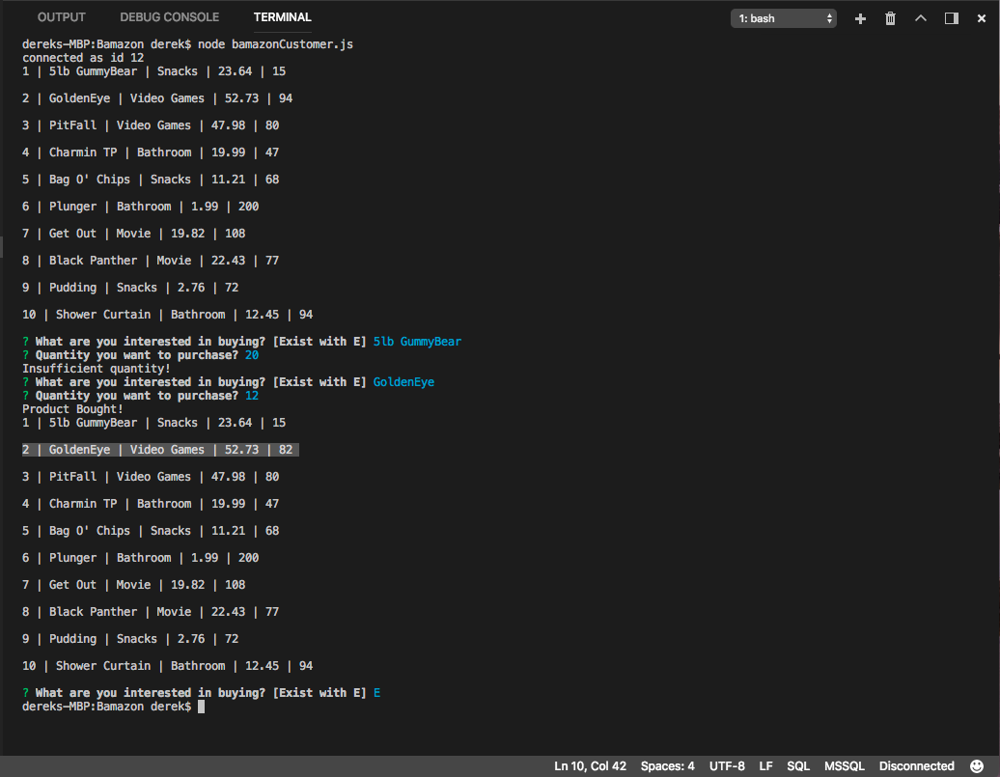

# Bamazon
CLI app that imitates an online store and utilizes MySQL and Node.js

 

 

 ***
## Getting Started

 - Clone repo.
 - Run 'npm install' in command line.
 - Run 'node index.js' to get started playing the game.

***
## Technologies Used:

 * Javascript
 * nodeJS
 * MySQL

***
##  Installs
 
### Inquirer
 - `npm install inquirer`
 
### MySQL
 - `npm install mysql`

***
## Contributors: 

 - Derek Frand [GitHub](https://github.com/Dfrand)
 